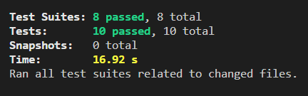

<h1>React photo app</h1>
<p>A small React photo app, bootstrapped with create-react-app that queries Pexels Photo API <a href="https://www.pexels.com/api/">https://www.pexels.com/api/</a> and displays images. Has a custom pager, a "Showing n of n+1 photos" section and a search input box.</p>
<ul>
<li>It only and intentionally targets desktops and tablets. Not a phone app.</li>
<li>Uses JEST <a href="https://jestjs.io/">https://jestjs.io</a> for unit testing</li>
<li>Uses React Custom Hooks to fetch the data</li>
<li>Contains Error Boundary</li>
<li>Uses Lazy Component Loading</li>
<li>All code is written in ReactJs</li>
</ul>
<h2>Before you start</h2>
<p>Before you start, one has to get an API private key from Pexels. It is free, but limits number of requests per hour.You can upgrade and/or contact their customer support to obtain more details.</p>
<h2>To start</h2>
<ul>
<li>Clone this repository</li>
<li>Obtain your personal unique API key from Pexels</li>
<li>Paste it in <code>useCrud.js</code> React custom hook
<p><code>
 headers: {<br>
            Authorization:<br>
            "your-unique-custom-Pexels-API-key",<br>
            "Content-Type": "application/json",<br>
          }
</code></p>
</li>
<li>run <code>npm install</code></li>
<li>run <code>npm start</code></li>
<li>Below is the video of running this react app</li>
</ul>

https://user-images.githubusercontent.com/36752411/190461541-d7671954-6ad9-4519-a520-c0b458c246b9.mp4

<h2>Unit Testing</h2>
<p>Unit tests were written with the help of JEST <a href="https://jestjs.io/">https://jestjs.io/</a></p>
<p>All tests succedded. Img below:</p>
<p align="center">
  
</p>
<p>Jest unit test for custom react hook (useCrud.js) with mock fetch api is found under <code>/hooks/useCrud.test.js</code></p>
<p>✅<u>Custom React Hook Jest Test</u></p>

```
import { useCrud } from "./useCrud";
import { renderHook, act } from "@testing-library/react-hooks/pure";

const mock = { isLoading: null, fetchedData: null, fetchedHeaderData: null };
jest.mock("./CrudWrapper", () => ({
  useCrud: () => {
    return mock;
  },
}));

test("can mock fetch and test the useCrud custom hook", async () => {
  mock.isLoading = false;
  mock.fetchedHeaderData = [
    {
      page: 1,
      per_page: 16,
      total_results: 8000,
      next_page:
        "https://api.pexels.com/v1/search/?page=2&per_page=16&query=birds",
    },
  ];
  mock.fetchedData = [
    {
      id: 162140,
      width: 4275,
      height: 2539,
      url:
        "https://www.pexels.com/photo/duckling-on-black-soil-during-daytime-162140/",
      photographer: "Pixabay",
      photographer_url: "https://www.pexels.com/@pixabay",
      photographer_id: 2659,
      avg_color: "#756246",
      src: {
        original:
          "https://images.pexels.com/photos/162140/duckling-birds-yellow-fluffy-162140.jpeg",
        large2x:
          "https://images.pexels.com/photos/162140/duckling-birds-yellow-fluffy-162140.jpeg?auto=compress&cs=tinysrgb&dpr=2&h=650&w=940",
        large:
          "https://images.pexels.com/photos/162140/duckling-birds-yellow-fluffy-162140.jpeg?auto=compress&cs=tinysrgb&h=650&w=940",
        medium:
          "https://images.pexels.com/photos/162140/duckling-birds-yellow-fluffy-162140.jpeg?auto=compress&cs=tinysrgb&h=350",
        small:
          "https://images.pexels.com/photos/162140/duckling-birds-yellow-fluffy-162140.jpeg?auto=compress&cs=tinysrgb&h=130",
        portrait:
          "https://images.pexels.com/photos/162140/duckling-birds-yellow-fluffy-162140.jpeg?auto=compress&cs=tinysrgb&fit=crop&h=1200&w=800",
        landscape:
          "https://images.pexels.com/photos/162140/duckling-birds-yellow-fluffy-162140.jpeg?auto=compress&cs=tinysrgb&fit=crop&h=627&w=1200",
        tiny:
          "https://images.pexels.com/photos/162140/duckling-birds-yellow-fluffy-162140.jpeg?auto=compress&cs=tinysrgb&dpr=1&fit=crop&h=200&w=280",
      },
      liked: false,
      alt: "Duckling on Black Soil during Daytime",
    },
  ];

  const { result } = renderHook(() => useCrud());
  expect(result).toBeTruthy();

  await act(async () => {});
});


```
<p>To see static <code>flex</code> container in the middle that displays the photos, I created a playground here  <a href = "https://963511.playcode.io/">https://963511.playcode.io/</a> </p>

enjoy ! :blush:
